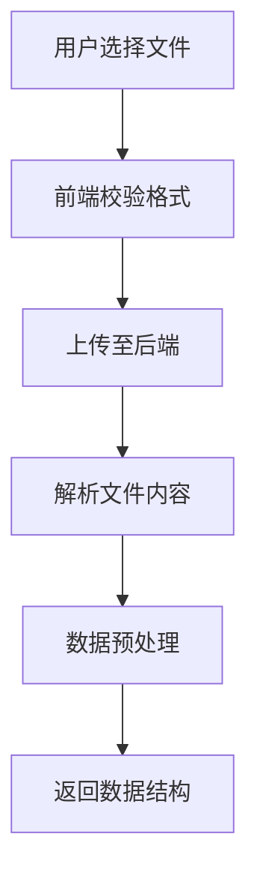

# 需求文档：智能可视化报表生成系统

> 本文档遵循 **fullstack-coolify-workflow** 工作流规范，涵盖需求澄清、API 契约、边缘情况、Coolify 部署与测试规范。

**工作流五阶段对照**：
| 阶段 | 本文档对应章节 |
|------|----------------|
| 1. 完善需求 | §0 PRD 摘要、§5 UI 交互与边缘情况 |
| 2. Python + React 开发 | §2–§12 |
| 3. Coolify 适配 | §13.2 |
| 4. 本地测试 & TEST_STEPS.md | §14 |
| 5. Git 发布 | §15 |

---

## 0. PRD 摘要（需求共识）

| 项目 | 说明 |
|------|------|
| **产品名称** | 智能可视化报表生成系统 |
| **核心价值** | 用户上传 CSV/Excel 数据 → 系统自动解析 → 按规则生成可交互的可视化图表 |
| **目标用户** | 需要快速从表格数据生成分析图表的业务人员 |
| **前后端分离** | React 前端 + Python (FastAPI) 后端，通过 REST API 交互 |

**共识确认要点**（开发前需 100% 达成一致）：
- [ ] 支持的文件格式：CSV、Excel (.xlsx)
- [ ] 文件大小上限：10MB
- [ ] 图表类型：柱状图、折线图、饼图、散点图
- [ ] 数据持久化：当前为会话级（上传后仅在当前会话可用），或可扩展为持久化存储

---

## 1. 项目概述
开发一个智能可视化报表系统，允许用户上传数据文件，系统根据预定义规则自动生成可视化图表。

## 2. 系统架构
- **前端**: React + Ant Design
- **后端**: Python Flask/FastAPI
- **数据处理**: Pandas
- **可视化**: ECharts

## 3. 核心功能

### 3.1 文件上传模块


### 3.2 规则配置模块
- **规则定义**: 支持JSON格式的规则配置
- **规则类型**: 字段映射、图表类型、聚合方式、过滤条件
- **规则示例**:
```json
{
  "charts": [
    {
      "title": "金额分布柱状图",
      "type": "bar",
      "x_field": "销区",
      "y_field": "金额",
      "aggregation": "sum",
      "filter": "金额 > 0"
    }
  ]
}
```

### 3.3 可视化生成模块
- **图表类型**: 柱状图、折线图、饼图、散点图
- **数据聚合**: sum、avg、count、max、min
- **交互功能**: 图表联动、数据下钻、筛选

## 4. API 接口契约（前后端约定）

> 以下为前后端 100% 共识的 API 契约，开发时严格遵循。

### 4.1 文件上传接口

| 方法 | 路径 | 说明 |
|------|------|------|
| POST | `/api/upload` | 上传 CSV/Excel 文件 |

**请求**：
- Content-Type: `multipart/form-data`
- Body: `file` (必填)

**成功响应** `200`:
```json
{
  "success": true,
  "file_id": "uuid-xxx",
  "data": {
    "columns": ["供应商", "金额", "销区", "品牌部"],
    "sample_data": [{"供应商": "A", "金额": 1000, "销区": "华东", "品牌部": "X"}],
    "statistics": {
      "row_count": 23,
      "column_count": 15
    }
  }
}
```

**错误响应** `4xx/5xx`:
```json
{
  "success": false,
  "error": "FILE_TOO_LARGE",
  "message": "文件大小超过 10MB 限制"
}
```

### 4.2 图表生成接口

| 方法 | 路径 | 说明 |
|------|------|------|
| POST | `/api/generate-charts` | 根据 file_id 和规则生成图表 |

**请求体**:
```json
{
  "file_id": "uuid-xxx",
  "rules": [
    {
      "chart_id": "chart_1",
      "title": "金额分布",
      "type": "bar",
      "config": {
        "x_field": "销区",
        "y_field": "金额",
        "aggregation": "sum",
        "filter": "金额 > 0"
      }
    }
  ]
}
```

**成功响应** `200`:
```json
{
  "success": true,
  "charts": [
    {
      "chart_id": "chart_1",
      "option": { "title": {...}, "xAxis": {...}, "yAxis": {...}, "series": [...] },
      "data": [{"category": "华东", "value": 50000}]
    }
  ]
}
```

### 4.3 错误码约定

| 错误码 | HTTP 状态 | 说明 |
|--------|-----------|------|
| `INVALID_FILE_FORMAT` | 400 | 不支持的文件格式 |
| `FILE_TOO_LARGE` | 413 | 文件超过 10MB |
| `FILE_NOT_FOUND` | 404 | file_id 无效或已过期 |
| `INVALID_RULE` | 400 | 规则配置错误（如字段不存在） |
| `SERVER_ERROR` | 500 | 服务器内部错误 |

## 5. UI 交互逻辑与边缘情况

### 5.1 主流程
1. 用户进入首页 → 拖拽/选择文件上传
2. 上传成功 → 展示列名、样本数据、统计信息
3. 用户配置规则（或使用默认推荐）→ 点击「生成图表」
4. 图表渲染完成 → 支持导出、筛选、下钻

### 5.2 边缘情况处理

| 场景 | 前端处理 | 后端处理 |
|------|----------|----------|
| 文件格式错误 | 上传前校验扩展名，提示用户 | 二次校验，返回 `INVALID_FILE_FORMAT` |
| 文件超 10MB | 上传前检查 `file.size`，阻止并提示 | 拒绝请求，返回 413 |
| 空文件 / 无有效列 | 展示错误提示，引导重新上传 | 解析失败时返回明确错误信息 |
| file_id 过期 | 检测 404 响应，提示重新上传 | 会话内 file_id 超时返回 404 |
| 规则中字段不存在 | 规则校验时高亮错误字段 | 返回 `INVALID_RULE` 及具体字段名 |
| 网络超时 | 显示 Loading，超时后重试/提示 | 设置合理超时时间 |
| 大数据量（如 10 万行） | 分页预览，提示可能较慢 | 考虑采样或异步任务 |

### 5.3 文件上传组件
```javascript
// FileUploader.jsx
主要功能:
- 支持拖拽上传
- 支持CSV/Excel格式
- 实时预览数据
- 文件大小限制(10MB)
```

### 5.4 规则配置组件
```javascript
// RuleConfigurator.jsx
主要功能:
- 字段选择器
- 图表类型选择
- 聚合方式配置
- 规则保存/加载
```

### 5.5 图表展示组件
```javascript
// ChartRenderer.jsx
主要功能:
- 渲染ECharts图表
- 支持图表导出
- 响应式布局
- 主题切换
```

## 6. 后端服务设计

### 6.1 数据处理服务
```python
# data_processor.py
class DataProcessor:
    def __init__(self, file_path):
        self.df = pd.read_csv(file_path)
    
    def get_columns(self):
        return self.df.columns.tolist()
    
    def generate_chart_data(self, rule):
        # 根据规则处理数据
        pass
    
    def get_statistics(self):
        # 返回数据统计信息
        pass
```

### 6.2 图表生成服务
```python
# chart_generator.py
class ChartGenerator:
    def generate_bar_chart(self, data, config):
        option = {
            "title": {"text": config["title"]},
            "xAxis": {"type": "category", "data": data["categories"]},
            "yAxis": {"type": "value"},
            "series": [{"type": "bar", "data": data["values"]}]
        }
        return option
    
    def generate_line_chart(self, data, config):
        # 生成折线图配置
        pass
    
    def generate_pie_chart(self, data, config):
        # 生成饼图配置
        pass
```

## 7. 数据预处理规则

### 7.1 字段类型识别
- **数值字段**: 金额、数量等
- **分类字段**: 销区、品牌部、供应商等
- **时间字段**: 业务发生日期
- **文本字段**: 重要事项说明

### 7.2 数据清洗规则
1. 空值处理
2. 异常值检测
3. 数据类型转换
4. 重复值处理

## 8. 默认可视化规则

### 8.1 基于字段类型的自动推荐
```json
{
  "rules": {
    "numerical_fields": {
      "recommended_charts": ["histogram", "boxplot"],
      "aggregations": ["sum", "avg", "max", "min"]
    },
    "categorical_fields": {
      "recommended_charts": ["bar", "pie"],
      "aggregations": ["count"]
    },
    "datetime_fields": {
      "recommended_charts": ["line", "area"],
      "aggregations": ["sum", "avg"]
    }
  }
}
```

### 8.2 智能图表推荐
```python
# 根据数据特征推荐图表
def recommend_charts(df, column):
    if pd.api.types.is_numeric_dtype(df[column]):
        if len(df[column].unique()) > 10:
            return ["histogram", "boxplot"]
        else:
            return ["bar", "pie"]
    elif pd.api.types.is_datetime64_any_dtype(df[column]):
        return ["line", "area"]
    else:
        return ["bar", "pie"]
```

## 9. 示例配置（基于应收厂家待处理事项表）

### 9.1 字段映射配置
```json
{
  "field_mappings": {
    "供应商": "supplier",
    "金额": "amount",
    "销区": "sales_region",
    "品牌部": "brand_department",
    "业务发生日期": "business_date",
    "重要事项说明": "description"
  }
}
```

### 9.2 预定义分析规则
```json
{
  "predefined_rules": [
    {
      "name": "金额分布分析",
      "charts": [
        {
          "id": "amount_by_region",
          "title": "各销区金额分布",
          "type": "bar",
          "x_field": "sales_region",
          "y_field": "amount",
          "aggregation": "sum"
        },
        {
          "id": "amount_trend",
          "title": "金额时间趋势",
          "type": "line",
          "x_field": "business_date",
          "y_field": "amount",
          "aggregation": "sum",
          "time_unit": "month"
        }
      ]
    }
  ]
}
```

## 10. 开发任务分解

### 第一阶段：基础框架（2周）
1. 搭建前后端项目结构
2. 实现文件上传功能
3. 基础数据解析

### 第二阶段：核心功能（3周）
1. 规则配置界面开发
2. 图表生成引擎
3. 数据预处理模块

### 第三阶段：增强功能（2周）
1. 智能推荐功能
2. 图表交互功能
3. 导出功能

### 第四阶段：测试优化（1周）
1. 单元测试
2. 性能优化
3. 用户体验优化

## 11. 技术栈要求

### 前端
- React 18+
- Ant Design 5+
- ECharts 5+
- Axios

### 后端
- Python 3.9+
- FastAPI/Flask
- Pandas
- openpyxl (Excel处理)

### 开发工具
- Git
- Docker
- ESLint/Prettier
- Pytest

## 12. 测试用例

### 12.1 文件上传测试
- 测试各种文件格式（CSV、Excel）
- 测试大文件处理
- 测试异常文件处理

### 12.2 图表生成测试
- 测试不同图表类型
- 测试数据聚合准确性
- 测试性能（大数据量）

## 13. 部署要求与 Coolify 适配

### 13.1 环境要求
- Node.js 16+
- Python 3.9+
- 内存：4GB+
- 存储：10GB+

### 13.2 Coolify 框架适配（遵循 fullstack-coolify-workflow）

**项目结构要求**：
- 前后端分离：前端构建为静态资源，后端独立服务
- 根目录需包含 `Dockerfile` 或 `docker-compose.yml`

**Docker 规范**：
| 服务 | 构建方式 | 暴露端口 |
|------|----------|----------|
| 前端 | `npm run build` → 静态文件由 Nginx 托管 | 80 |
| 后端 | Python FastAPI/Flask，gunicorn/uvicorn | 8000 |

**Coolify 环境变量清单**：
| 变量名 | 说明 | 示例 |
|--------|------|------|
| `API_URL` / `VITE_API_URL` | 前端请求的后端 API 地址 | `https://api.yourdomain.com` |
| `CORS_ORIGINS` | 后端允许的跨域来源 | `https://yourdomain.com` |
| `MAX_UPLOAD_SIZE` | 上传文件大小限制（字节） | `10485760` (10MB) |
| `SESSION_TIMEOUT` | file_id 会话超时时间（秒） | `3600` |

### 13.3 部署方式
1. 传统部署（Nginx + uWSGI）
2. Docker 容器化（推荐用于 Coolify）
3. 云原生部署（Kubernetes）

---

## 14. 本地测试与 QA 规范

> 开发完成后须生成 `TEST_STEPS.md`，供人工验收使用。

### 14.1 环境准备
- 后端：`pip install -r requirements.txt && uvicorn main:app --reload`
- 前端：`npm install && npm run dev`

### 14.2 测试场景
- **正常路径**：上传合规文件 → 配置规则 → 生成图表
- **错误路径**：上传超大/错误格式文件、无效规则、断网等

### 14.3 验证步骤
详见项目根目录 `TEST_STEPS.md`（开发阶段生成）。

---

## 15. Git 发布检查清单

提交前确认：
- [ ] `git status` 无敏感信息（密钥、Token、真实环境变量）
- [ ] 提交信息格式：`feat: 实现 [功能名称] - 包含后端 API 和前端 UI`
- [ ] 已执行本地测试，`TEST_STEPS.md` 中的场景通过

---

**注**：本文档基于「应收厂家待处理事项跟进表」的数据特征编写，遵循 fullstack-coolify-workflow 五阶段工作流，实际开发时可根据具体需求调整规则配置。
